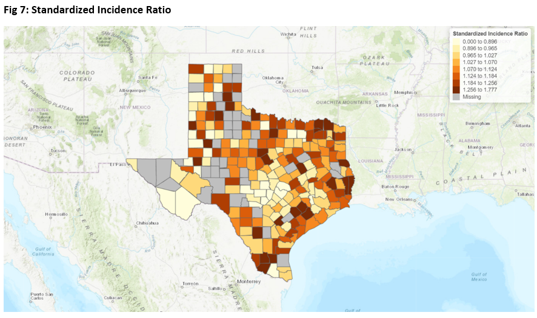
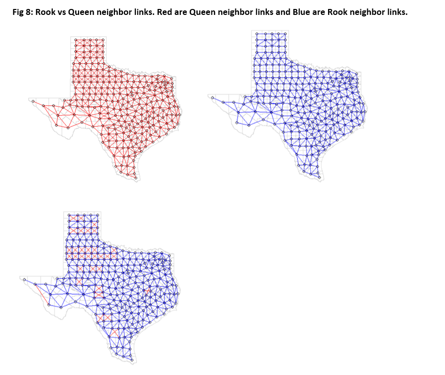
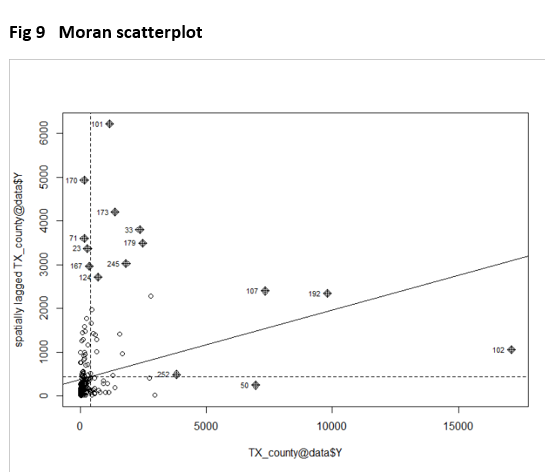
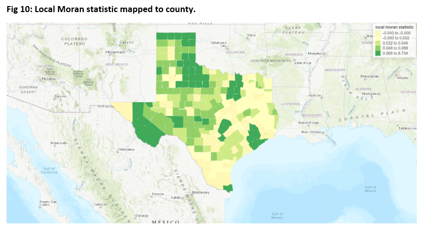
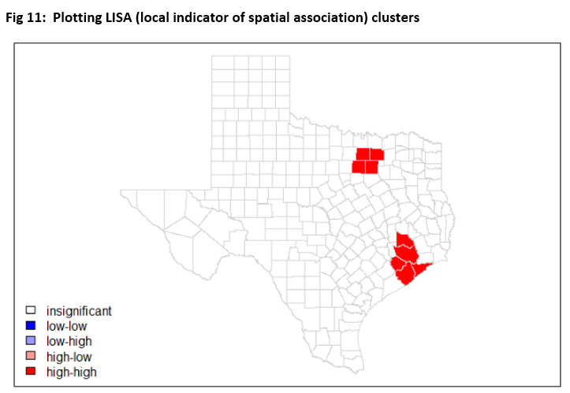
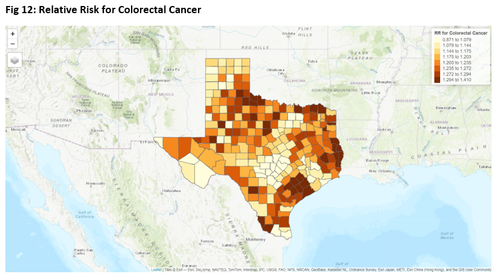

# Spatial analysis of county-level Colorectal Cancer incidence in Texas and Bayesian analysis of association with county-level smoking and education demographic data

**Author**
[Khush Patel, MD](https://khushpatelmd.github.io/)

<hr />

**Background**: Colorectal cancer (CRC) is the third most common cancer[1, 2] in both males and females in the United States of America. Potentially modifiable behavior which are risk factors include smoking, unhealthy diet and obesity[3]. Other important factor is CRC screening rate. CRC screening has been significantly linked to education level in past studies[4, 5]. Relatively few studies have been conducted to examine how county level smoking status, education level and race information affects the geographic distribution of colorectal cancer incidence, and no study has been conducted to investigate this at the county level in the state of Texas. Identification of geographic patterns of colorectal cancer incidence could provide impetus to conduct further investigations and target health resources for prevention and treatment in specific geographic areas.

**Methods**: County level colorectal cancer incidence data for Texas were obtained for the years 2009 to 2018 were obtained from the Texas Cancer Registry, Cancer Epidemiology and Surveillance Branch, Texas Department of State Health Services. Corresponding years demographic data at county level was obtained for smoking, bachelor’s degree as a proxy to colorectal cancer screening awareness and race. Exploratory analysis using Moran’s I at global and local level was performed. Bayesian Poisson Model, Bayesian non-spatial model (iid model with non-spatial random effects) and Bayesian Spatial model (Conditional autoregressive (ICAR) model with spatial and non-spatial random effects) were fitted. We also developed a unique, novel statistical imputation method for suppressed cancer data not used before in any other spatial studies.

**Results**: We found local Moran’s I to have positive spatial autocorrelation with value of +0.16 with p value <0.01. We found Conditional autoregressive (ICAR) model with spatial and non-spatial random effects fitted in INLA to be the model with lowest WAIC. All the models showed county level smoking data to be significantly associated with colorectal cancer incidence.

**Conclusion**: Colorectal cancer incidence showed significant autocorrelation amongst the county. County smoking data was significantly associated with Colorectal cancer incidence. 

<hr />

# Table Of Contents
-  [Research paper](#Paper)
-  [Requirements](#Requirements)
-  [Code structure](#Code-structure)
-  [Sample plots](#Sample-plots)
-  [How to cite](#How-to-cite)

<hr />

# Research paper

[Full research paper](images/Spatial_analysis_Khush_Patel.pdf)


<hr />

# Requirements

```
classInt 0.4-8
dplyr 1.0.10
grid 4.2.1
gridExtra 2.3
INLA 22.05.07
maptools 1.1-4
RColorBrewer 1.1-3
rgdal 1.5-32
readxl 1.4.1
rgeos 0.5-9
tidyverse 1.3.2
spdep 1.2-7
spgwr 0.6-35
tmap 3.3-3
```

<hr />

# Code structure
```
├──  Main code
│    └── code_spatial_analysis.py - R script for complete analysis
│
├──  data  
│    └── unimputed_data.csv - County level colorectal cancer incidence data for Texas were obtained for the years 2009 to 2018 were obtained from the Texas Cancer     Registry, Cancer Epidemiology and Surveillance Branch, Texas Department of State Health Services 
     └── dataset_for_modeling_imputed.csv - Imputed, cleaned dataset. Data imputation using machine learning model based on bayesian ridge regression
     └──shapefiles for plotting - .dbf, .prj, .shp, .shx

```


<hr />

# Sample plots (Refer to full paper for the description)













<hr />

#How to run the code


